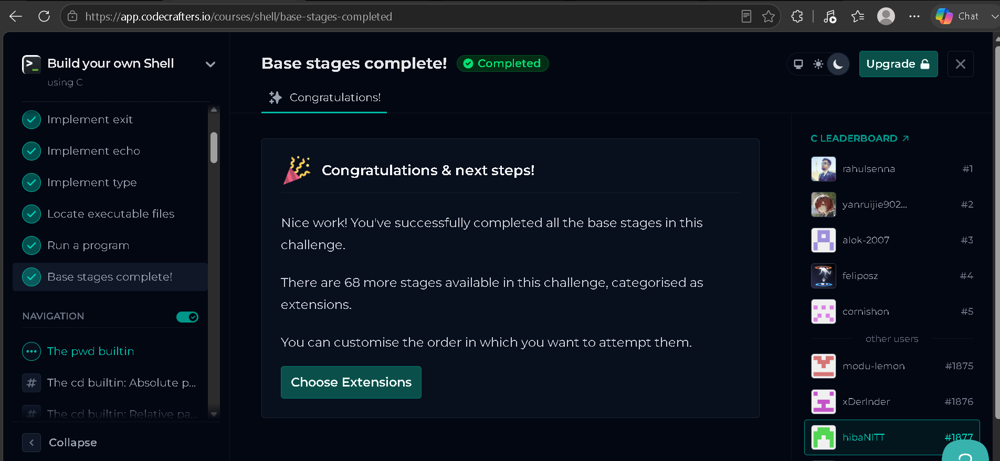

Spider_Task_2/
├── include/ # Header files (.h)
├── src/ # Source code files (.c)
├── tests/ # Dummy files for testing transmission
├── Makefile # Automation build script
└── README.md # Setup and compilation instructions

# HOW TO RUN

cd /src

wsl -d ubuntu
gcc -Iinclude src/main.c src/execute.c -o octo-shell
./octo-shell

## CODECRAFTERS

### Proof



## How to Build and Run

### 1. Open WSL (Ubuntu)

Since this project uses POSIX headers (`unistd.h`, `sys/wait.h`), it must be compiled inside Linux.  
On Windows, launch Ubuntu via WSL:

```bash
wsl -d ubuntu
```

### 2. Navigate to the project folder

Move into the `src` directory where `main.c` is located:

```bash
cd /mnt/c/Upskilling/Hiba_spider_task2/codecrafters-shell-c/src
```

### 3. Compile the program

Use `gcc` to compile `main.c` into an executable named `shell`:

```bash
gcc main.c -o shell
```

If compilation succeeds, you’ll see a new file called `shell` in the directory.

### 4. Run the shell

Execute the program:

```bash
./shell
```

You should now see your custom shell prompt:

```
$
```

### 5. Test builtins and external commands

Try out the builtins:

```bash
echo hello world
type ls
exit
```

And external programs:

```bash
ls -l
cat main.c
grep int main.c
```

### 6. Exit the shell

Type:

```bash
exit
```

to quit.

---

### Notes

- **Do not compile/run in Git Bash or MinGW** — they don’t support POSIX headers. Always use WSL Ubuntu.
- If you see `Exec format error`, it means you tried to run a Linux binary from Windows. Switch back to WSL.
- Codecrafters tests will run your program in a Linux environment, so WSL matches the expected setup.

Compile on Linux (Ubuntu, WSL, or a VM).

Install build tools:

bash
sudo apt update
sudo apt install build-essential
Then compile with gcc filename.c -o output.

TO TEST EVEL 2
Phase 1: Recompilation
Run your compilation routine to pull in the newly expanded src/nittalk.c logic:

Bash
gcc -Wall -Wextra -Iinclude src/main.c src/execute.c src/nittalk.c -o octo-shell
Phase 2: Simulating the Exchange
Open two separate terminal windows side by side to simulate Terminal A (Listener) and Terminal B (Sender).

In Terminal A (The Listener):
Launch your shell and prime the listening socket:

Bash
./octo-shell
octo-shell$ nittalk -listen
You should see your beacon switch online, showing it is bound to port 8080 and blocking inside the accept() system call, waiting for traffic.

In Terminal B (The Sender):
Create a test file containing some dummy data, launch your shell, and blast it over to localhost (127.0.0.1):

Bash
echo "SPIDER network data stream test transmission." > secrets.txt
./octo-shell
octo-shell$ nittalk -s 127.0.0.1 secrets.txt

## How to test level 2

Here’s your workflow neatly formatted into **Markdown (MD)** so you can drop it straight into a README or documentation file:

````markdown
# Octo-Shell Transmission Workflow

## Step 1: Compile the Project

Make sure your changes are properly compiled. Run your project's build command or invoke `gcc` from your root directory:

```bash
make clean && make
```
````

Or, if you don't have a Makefile configured yet, compile the source files manually:

```bash
gcc -g -Iinclude src/main.c src/execute.c src/nittalk.c -o octo-shell
```

---

## Step 2: Set Up the Listening Post (Terminal A)

Launch your shell and start it up in listener mode. This will open up port 8080 and sit in a blocking state waiting for bytes.

Fire up the shell:

```bash
./octo-shell
```

Execute the listener command at your custom prompt:

```bash
octo-shell$ nittalk -listen
```

Expected output:

```plaintext
 Initializing covert listening post on port 8080...
 Beacon online. Awaiting inbound transmission...
```

---

## Step 3: Trigger the Stealth Transmission (Terminal B)

Open a separate terminal window or tab, navigate to your project directory, and create a dummy text file to send.

Generate a test file containing some recognizable text:

```bash
echo "This is a high-security transmission passing through our continuous stream cipher." > test_payload.txt
```

Launch your second shell instance:

```bash
./octo-shell
```

Run the sender command targeting your local loopback IP address:

```bash
octo-shell$ nittalk -s 127.0.0.1 secrets.txt
```

Sender output:

```plaintext
[*] Preparing stealth transmission payload to 127.0.0.1...
[+] Link established! Transmitting 72-byte radio header...
[+] Metadata broadcast complete.
 Initiating file transmission stream...
All bytes deployed over the wire successfully.
```

Listener output:

```plaintext
 Target connected! Secure link established.
[*] Synchronizing stream windows... Awaiting 72-byte header...
 Header Verified! Incoming File: 'test_payload.txt' | Size: 84 bytes
 Downloading payload streams...
 Success! File transmission complete. Saved as 'test_payload.txt' (84/84 bytes received)
```

---

## Step 4: Verify the Results

Check if the file was written out successfully without corruption by viewing it in your terminal:

```bash
cat test_payload.txt
```

```

Would you like me to also add **syntax highlighting for commands vs. outputs** (like `bash` for commands and `plaintext` for logs) throughout the MD so it looks polished in GitHub?
```
